# 🚨 Awesome Critical Event Management (CEM)

<div align="center">



<p align="center">
  <a href="https://github.com/ishandutta2007/Awesome-Awesome-Awesome"></a>
  <a href="https://discord.gg/jc4xtF58Ve"></a>
  <a href="https://github.com/ishandutta2007/Awesome-Critical-Event-Management/stargazers"></a>
  <a href="https://github.com/ishandutta2007/Awesome-Critical-Event-Management/network/members"></a>
  <a href="https://github.com/ishandutta2007/Awesome-Critical-Event-Management/blob/main/LICENSE"></a>
  <a href="http://makeapullrequest.com"></a>
  <a href="https://github.com/ishandutta2007"></a>
</p>

**Curated Ecosystem of SaaS Platforms, Enterprise Solutions & Open-Source Projects for Critical Event Management (CEM), Emergency Notification (MNS), Incident Response, Crisis Management & Organizational Resilience**

*Last updated: August 2026*

</div>

---

## 📖 Overview & SEO Index

**Critical Event Management (CEM)** encompasses the technologies, processes, and systems that organizations use to detect operational disruptions and physical/cyber threats, assess geospatial and business impact, notify affected populations via multi-channel mass notification systems (MNS), orchestrate tactical incident response teams, maintain real-time situational awareness in Emergency Operations Centers (EOC), and recover swiftly to maintain business continuity (BCM).

This directory tracks the landscape across **enterprise SaaS/hosted platforms** and **open-source developer tooling**, spanning:
* 📡 **Mass Notification & Public Alerting** (SMS, Voice Calls, Push, Email, Cell Broadcast, Desktop Pop-ups, PA Systems)
* 🚨 **Incident Detection, Monitoring & Observability** (AIOps, IoT telemetry, sensor networks, infrastructure health)
* ⏰ **On-Call Escalation & Alert Routing** (Automated duty rotations, paging, acknowledgment tracking)
* 🚒 **Emergency Operations Centers (EOC) & Computer-Aided Dispatch (CAD)** (First responder management, AVL, logistics)
* 🛡️ **Business Continuity Management (BCM) & Risk Intelligence** (Threat intelligence, impact analysis, resilience planning)
* 🗺️ **Geospatial Intelligence & Crisis Mapping** (GIS mapping, disaster triage, evacuation routing)

---

## 📋 Table of Contents

* [🏢 SaaS & Enterprise Hosted Platforms](#-saas--enterprise-hosted-platforms)
* [🌐 Open-Source GitHub Projects](#-open-source-github-projects)
* [🔬 Additional Open-Source & Research Projects](#-additional-open-source--research-projects)
  * [📡 Emergency Warning & Public Alerting](#-emergency-warning--public-alerting)
  * [🚨 Incident Detection & Monitoring](#-incident-detection--monitoring)
  * [🔔 Notification & Communication Infrastructure](#-notification--communication-infrastructure)
  * [⏰ On-Call & Escalation Management](#-on-call--escalation-management)
  * [🚒 Emergency Operations & Dispatch (CAD)](#-emergency-operations--dispatch-cad)
  * [🗺️ Crisis Mapping & Humanitarian Response](#️-crisis-mapping--humanitarian-response)
  * [🔄 Data & Integration Infrastructure](#-data--integration-infrastructure)
* [🏗️ Building a Custom Open-Source Critical Event Management Stack](#️-building-a-custom-open-source-critical-event-management-stack)
  * [Recommended Open-Source Combinations](#recommended-open-source-combinations)
* [💡 Important Critical Event Management Concepts](#-important-critical-event-management-concepts)
* [📈 Star History](#-star-history)
* [🤝 How to Contribute](#-how-to-contribute)
* [⚠️ Disclaimer](#️-disclaimer)

---

## 🏢 SaaS & Enterprise Hosted Platforms

The following enterprise CEM, emergency notification, and operational resilience platforms are sorted in **descending order by company size** (market capitalization or enterprise valuation / revenue):

| Platform | Company Size (Valuation / Revenue) | Description | Starting Pricing | Free Tier / Free Trial Limits |
| :--- | :--- | :--- | :--- | :--- |
| **[ServiceNow](https://www.servicenow.com/)** | **~$125B+ Market Cap** (~$15.7B Revenue) | Enterprise digital workflow platform with crisis management, major incident management (MIM), emergency response, and business continuity capabilities. | Starts at ~$70–$100/fulfiller/month (~$10,000–$20,000/year minimum for ITSM/Incident Management tiers). | Free Personal Developer Instance (PDI) with full developer sandbox access via developer.servicenow.com; interactive demo library. |
| **[Rave Alert](https://www.motorolasolutions.com/)** | **~$77.7B Market Cap** (~$11B+ Revenue, Motorola Solutions) | Enterprise mass-notification and emergency communication capabilities (Motorola Solutions) for public safety, higher education, healthcare, and enterprise environments. | Starts at ~$2,500–$5,000/year (annual subscription based on population/seat count; free for end-user alert recipients). | No free-forever plan; 14-day to 30-day free trial available upon request (no credit card required). |
| **[Atlassian Jira Service Management](https://www.atlassian.com/software/jira/service-management)** | **~$39.1B Market Cap** (~$6.57B Revenue) | IT and enterprise service-management platform with major incident management, on-call scheduling, alerting, escalation, and incident collaboration. | Free tier ($0); Paid tiers start at $20/agent/month (billed annually) or $22.05/agent/month (billed monthly) for Standard plan; $51.42/agent/month for Premium plan. | Free-forever plan for up to 3 agents (includes 2 GB file storage, 100 email notifications/day, 500 automation runs/month); 7-day to 30-day free trial of Standard/Premium. |
| **[BlackBerry AtHoc](https://www.blackberry.com/us/en/products/blackberry-athoc)** | **~$5.1B Market Cap** (~$550M Revenue, BlackBerry) | Enterprise critical-event communications platform designed for secure mass notification, crisis communications, emergency response, and personnel accountability. | Starts at ~$5,000–$12,000/year (or ~$2.00–$5.00/user/year base alert licensing, varying by endpoint volume and modules). | No free-forever plan; enterprise demo and proof-of-concept environment available on request. |
| **[BlackBerry SecuSUITE](https://www.blackberry.com/us/en/products/secusuite)** | **~$5.1B Market Cap** (~$550M Revenue, BlackBerry) | High-assurance secure voice, messaging, and data communication technology for government agencies, defense, and enterprise crisis management. | Starts at ~$50–$100/user/month (~$600–$1,200/user/year, typically sold under high-security enterprise/government licensing agreements). | No free-forever plan; high-assurance security briefing and pilot evaluation available on request. |
| **[Resolver](https://www.resolver.com/)** | **~$3B+ Parent Valuation** (Kroll; ~$50M–$80M Revenue) | Risk and incident management platform supporting incident reporting, risk analysis, corporate security investigations, and organizational resilience workflows. | Starts at $10,000/year (base package for incident and risk management). | No free-forever plan; personalized product demo on request. |
| **[Everbridge](https://www.everbridge.com/)** | **~$1.8B Valuation** (~$450M+ Revenue, Thoma Bravo) | Enterprise critical event management platform for threat intelligence, incident response, mass notification, employee safety, crisis management, and organizational resilience. | Starts at ~$5,000/year (base Mass Notification); full enterprise CEM deployments range from $25,000 to $100,000+/year based on contact volume and modules. | No free-forever plan; provides an interactive guided trial / proof-of-concept environment upon request via sales demo. |
| **[AlertMedia](https://www.alertmedia.com/)** | **~$1B+ Valuation** (~$100M+ ARR, Vista Equity Partners) | Emergency communication and threat intelligence platform providing employee notification, global risk intelligence, incident management, and travel safety communications. | Starts at ~$2,500–$5,000/year (or ~$1.50/employee/month with 100+ user minimums; no setup fees). | No free-forever plan; customized live demo and guided trial environment available upon request. |
| **[OnSolve](https://www.onsolve.com/)** | **~$1B+ Valuation** (~$150M+ Revenue, GardaWorld / Crisis24) | Critical event management and mass-notification platform (CodeRED, Send Word Now) focused on threat intelligence, emergency communications, employee safety, and incident response. | Starts at ~$2,500–$5,000/year (or ~$1.50–$3.00/contact/year for base notification tiers, scaling with population and contact volume). | No free-forever plan; 14-day to 30-day customized trial/pilot available upon request. |
| **[Riskonnect](https://riskonnect.com/)** | **~$1B+ Valuation** (~$150M+ Revenue, Thoma Bravo & TA Associates) | Integrated risk management platform with capabilities spanning operational risk, business continuity, resilience, crisis management, and incident management. | Starts at ~$30,000–$50,000/year (enterprise modular licensing; full-scale enterprise implementations start higher). | No free-forever plan; personalized enterprise demonstration available on request. |
| **[PagerDuty](https://www.pagerduty.com/)** | **~$950M Market Cap** (~$500M ARR) | Digital-operations incident management and on-call platform providing alerting, escalation, incident response, status pages, and automated workflows. | Free tier ($0); Paid tiers start at $21/user/month (billed annually) or $25/user/month (billed monthly) for Professional plan; $41/user/month for Business plan. | Free-forever plan for up to 5 users (includes 100 SMS/phone notifications/month, 1 on-call schedule, 1 escalation policy); 14-day free trial of Business tier. |
| **[Fusion Risk Management](https://www.fusionrm.com/)** | **~$500M+ Valuation** (~$50M–$67M Revenue, Great Hill Partners) | Operational resilience platform combining business continuity, crisis management, risk management, incident management, and resilience planning. | Starts at ~$25,000–$30,000/year (Salesforce AppExchange / enterprise subscription based on selected risk/BCM modules). | No free-forever plan; interactive live demo and self-guided product tour available on request. |
| **[Singlewire InformaCast](https://www.singlewire.com/informacast)** | **~$300M–$400M Valuation** (~$25M+ Revenue, PSG Equity) | Emergency notification and mass-communication platform supporting desktop, mobile, IP speakers, digital signage, and other notification channels. | Starts at ~$4.50–$10.22/user/year (or ~$375/month for base 50-endpoint bundle; editions: Mobile, Advanced, Fusion). | No free-forever plan; 30-day free trial available upon request. |
| **[Alertus](https://www.alertus.com/)** | **~$150M–$200M Valuation** (~$25.4M Revenue) | Emergency mass-notification platform supporting desktop alerts, mobile notifications, digital signage, public-address systems, and alert beacons. | Starts at ~$2,470/year (base software license for small facilities; institutional packages range $10,000–$17,500+/year). | No free-forever plan; customized live demo and facility evaluation on request. |
| **[Veoci](https://www.veoci.com/)** | **~$100M–$150M Valuation** (~$20M–$40M Revenue) | Cloud-based emergency management and critical-event platform supporting incident management, emergency operations centers (EOC), crisis communications, and workflow automation. | Starts at ~$10,000–$15,000/year (annual subscription based on module selection and user/organization size). | No free-forever plan; no self-service trial (custom proof-of-concept and guided demo available on request). |
| **[Preparis](https://www.preparis.com/)** | **~$100M Valuation** (~$20M+ Revenue, Agility Recovery / LLR Partners) | Business continuity and emergency-management platform supporting crisis communications, emergency notification, continuity planning, and incident response. | Starts at ~$3,000–$5,000/year (or ~$2.00–$4.00/user/month depending on employee headcount and messaging bundles). | No free-forever plan; free guided demo and customized trial available upon request. |
| **[Noggin](https://www.noggin.io/)** | **~$75M–$100M Valuation** (~$21M Pre-acquisition Revenue, Motorola Solutions) | Integrated operational resilience and critical event management platform covering incident management, business continuity, crisis management, and emergency response. | Starts at ~$5,000–$10,000/year (Starter tier; tiered subscription: Starter, Premium, Enterprise). | No free-forever plan; guided product demonstration and pilot evaluation available upon request. |
| **[AlertFind](https://www.alertfind.com/)** | **~$50M–$100M Valuation** (~$15M–$25M Revenue, Aurea / ESW Capital) | Emergency communication and mass-notification platform for employee safety, incident communications, and critical-event response. | Starts at ~$5,000/year (annual subscription with options for unlimited recipient or message volume tiers). | No free-forever plan; personalized product demo and pilot setup available on request. |
| **[Regroup](https://www.regroup.com/)** | **~$50M–$80M Valuation** (~$10M–$15M Revenue) | Mass-notification and emergency communication platform for organizations needing rapid multi-channel communication during critical events. | Starts at ~$500/month (~$6,000/year base subscription for multi-channel messaging). | No free-forever plan; live demonstration and customized pilot available on request. |
| **[Omnilert](https://www.omnilert.com/)** | **~$30M–$50M Valuation** (~$5M–$10M Revenue) | Emergency notification and AI visual gun-detection platform supporting mass communications, campus safety, threat detection, and multi-channel alerts. | Starts at ~$2,500/year (~$200/month for small facilities/schools, scaling with user/camera count). | No free-forever plan; customized live demonstration and pilot evaluation on request. |
| **[SnapComms](https://www.snapcomms.com/)** | **~$30M+ Acquisition** (~$10M–$20M Revenue, Everbridge subsidiary) | Emergency and organizational communication platform supporting desktop alerts, pop-ups, screensavers, digital signage, and mass communications. | Starts at ~$1.50–$2.50/user/month (Inform package, minimum 100 users / ~$2,500/year). | No free-forever plan; 30-day full-featured free trial available. |
| **[Crises Control](https://www.crises-control.com/)** | **~$20M–$30M Valuation** (~$5M+ Revenue) | Critical event management and multi-channel mass-notification platform for crisis communications, emergency response, and business continuity. | Starts at £2.00 (~$2.50) per user/year (minimum annual contract; SMS and voice broadcast credits billed per usage). | No free-forever plan; 14-day free trial available (full access to core alerting features, no credit card required). |

---

## 🌐 Open-Source GitHub Projects

The following open-source projects provide capabilities across emergency notification, incident detection, CAD, on-call escalation, crisis coordination, and resilience infrastructure. They are sorted in **descending order by GitHub star count**:

1. * **[Home Assistant](https://github.com/home-assistant/core)** [](https://github.com/home-assistant/core/stargazers)
   Open-source home and facility automation platform that detects events from IoT sensors and connected devices to trigger emergency workflows, alerts, and life-safety automations. Licensed under Apache-2.0.

2. * **[Uptime Kuma](https://github.com/louislam/uptime-kuma)** [](https://github.com/louislam/uptime-kuma/stargazers)
   Self-hosted monitoring tool that provides high-speed event detection, health checking, and alert generation for critical services and infrastructure. Licensed under MIT.

3. * **[Netdata](https://github.com/netdata/netdata)** [](https://github.com/netdata/netdata/stargazers)
   Real-time, high-granularity infrastructure and operational health monitoring system designed for instant anomaly detection and incident alerting. Licensed under GPL-3.0.

4. * **[Grafana](https://github.com/grafana/grafana)** [](https://github.com/grafana/grafana/stargazers)
   Open-source observability and data visualization platform essential for building emergency operations center (EOC) situational-awareness dashboards and real-time incident monitoring boards. Licensed under AGPL-3.0.

5. * **[Redis](https://github.com/redis/redis)** [](https://github.com/redis/redis/stargazers)
   In-memory data structure store used for low-latency incident state management, real-time message queuing, deduplication, and rapid event distribution during crises. Licensed under BSD-3-Clause / RSALv2.

6. * **[Prometheus](https://github.com/prometheus/prometheus)** [](https://github.com/prometheus/prometheus/stargazers)
   Open-source systems monitoring and alerting toolkit designed for reliable event detection, dimensional metrics collection, and alerting rule execution. Licensed under Apache-2.0.

7. * **[Novu](https://github.com/novuhq/novu)** [](https://github.com/novuhq/novu/stargazers)
   Open-source notification infrastructure platform supporting multi-channel alert delivery (SMS, Email, Push, Chat, In-App) with workflow orchestration, digests, and subscriber management for emergency systems. Licensed under Apache-2.0.

8. * **[ntfy](https://github.com/binwiederhier/ntfy)** [](https://github.com/binwiederhier/ntfy/stargazers)
   HTTP-based pub-sub push notification service that delivers instant alerts and emergency broadcasts to mobile phones (Android/iOS) and desktop browsers with no sign-up required. Licensed under Apache-2.0 / GPL-2.0.

9. * **[Apache Kafka](https://github.com/apache/kafka)** [](https://github.com/apache/kafka/stargazers)
   High-throughput distributed event streaming platform used to ingest, buffer, and process high-volume critical event streams and sensor data in real time. Licensed under Apache-2.0.

10. * **[Mattermost](https://github.com/mattermost/mattermost)** [](https://github.com/mattermost/mattermost/stargazers)
    Secure, self-hosted collaboration and incident response platform featuring dedicated incident collaboration playbooks, runbooks, and command channels. Licensed under AGPL-3.0 / Apache-2.0.

11. * **[Jitsi Meet](https://github.com/jitsi/jitsi-meet)** [](https://github.com/jitsi/jitsi-meet/stargazers)
    Fully encrypted, open-source video conferencing solution used for establishing emergency virtual operations centers (EOCs) and crisis coordination bridge calls. Licensed under Apache-2.0.

12. * **[Apache Flink](https://github.com/apache/flink)** [](https://github.com/apache/flink/stargazers)
    Stateful real-time stream processing framework capable of complex event processing (CEP), anomaly detection, and correlation over critical event streams. Licensed under Apache-2.0.

13. * **[Node-RED](https://github.com/node-red/node-red)** [](https://github.com/node-red/node-red/stargazers)
    Low-code flow-based development environment for event-driven integration, connecting physical sensors, weather APIs, social feeds, and notification channels into automated crisis response workflows. Licensed under Apache-2.0.

14. * **[Gotify](https://github.com/gotify/server)** [](https://github.com/gotify/server/stargazers)
    Simple, self-hosted push notification server using WebSockets to send real-time alerts to Android devices and desktop clients. Licensed under MIT.

15. * **[Matrix Synapse](https://github.com/matrix-org/synapse)** [](https://github.com/matrix-org/synapse/stargazers)
    Decentralized, federated communication server providing end-to-end encrypted messaging, bridges, and resilient communications during infrastructure failures. Licensed under AGPL-3.0.

16. * **[Apprise](https://github.com/caronc/apprise)** [](https://github.com/caronc/apprise/stargazers)
    Universal push notification library supporting 90+ communication endpoints (SMS, Telegram, Discord, Slack, Twilio, Email, Webhooks, etc.) to unify emergency dispatch. Licensed under MIT.

17. * **[Element Web](https://github.com/element-hq/element-web)** [](https://github.com/element-hq/element-web/stargazers)
    Secure, decentralized web client for the Matrix protocol, providing end-to-end encrypted messaging, voice, and video for crisis response teams. Licensed under AGPL-3.0.

18. * **[OSRM Backend](https://github.com/Project-OSRM/osrm-backend)** [](https://github.com/Project-OSRM/osrm-backend/stargazers)
    High-performance routing engine built on OpenStreetMap data, designed for rapid emergency vehicle dispatch, evacuation routing, and travel-time calculations. Licensed under BSD-2-Clause.

19. * **[Dispatch](https://github.com/Netflix/dispatch)** [](https://github.com/Netflix/dispatch/stargazers)
    Netflix's open-source crisis and incident management orchestration engine that automates incident response, commander assignment, tactical room creation, documentation, and stakeholder notifications. Licensed under Apache-2.0.

20. * **[Zabbix](https://github.com/zabbix/zabbix)** [](https://github.com/zabbix/zabbix/stargazers)
    Enterprise-class open-source distributed monitoring platform capable of tracking millions of metrics from servers, networks, IoT sensors, and environmental monitors. Licensed under AGPL-3.0.

21. * **[Grafana OnCall](https://github.com/grafana/oncall)** [](https://github.com/grafana/oncall/stargazers)
    Open-source on-call management and alerting system featuring flexible scheduling, escalation chains, SMS/phone notifications, and Slack/Telegram integrations. Licensed under AGPL-3.0.

22. * **[Alertmanager](https://github.com/prometheus/alertmanager)** [](https://github.com/prometheus/alertmanager/stargazers)
    Deduplication, grouping, silencing, and routing engine for Prometheus alerts, delivering emergency notifications to downstream on-call and response systems. Licensed under Apache-2.0.

23. * **[Apache NiFi](https://github.com/apache/nifi)** [](https://github.com/apache/nifi/stargazers)
    Enterprise data integration platform providing real-time data ingestion, transformation, routing, and provenance tracking for emergency intelligence feeds. Licensed under Apache-2.0.

24. * **[Keep](https://github.com/keep-st/keep)** [](https://github.com/keep-st/keep/stargazers)
    Open-source AIOps and alert management platform that correlates alerts, deduplicates incidents, and automates emergency mitigation workflows. Licensed under MIT.

25. * **[TheHive](https://github.com/TheHive-Project/TheHive)** [](https://github.com/TheHive-Project/TheHive/stargazers)
    Security incident response and crisis investigation platform designed for collaborative triage, case tracking, evidence collection, and response playbook execution. Licensed under AGPL-3.0.

26. * **[Alerta](https://github.com/alerta/alerta)** [](https://github.com/alerta/alerta/stargazers)
    Scalable alert monitoring and management console that aggregates alerts from multiple monitoring systems into a unified situational-awareness feed. Licensed under Apache-2.0.

27. * **[GoAlert](https://github.com/target/goalert)** [](https://github.com/target/goalert/stargazers)
    Target's open-source on-call scheduling, notification, and automated escalation system supporting SMS, voice calls, and multi-tier escalation policies. Licensed under Apache-2.0.

28. * **[OpenStreetMap Website](https://github.com/openstreetmap/openstreetmap-website)** [](https://github.com/openstreetmap/openstreetmap-website/stargazers)
    The core Rails application and API supporting OpenStreetMap, providing global geospatial mapping infrastructure essential for crisis mapping and disaster response. Licensed under GPL-2.0.

29. * **[OpenTripPlanner](https://github.com/opentripplanner/OpenTripPlanner)** [](https://github.com/opentripplanner/OpenTripPlanner/stargazers)
    Open-source multimodal journey planning engine used for emergency evacuation planning, public transit disruption modeling, and responder mobility routing. Licensed under LGPL-3.0.

30. * **[SnailyCAD](https://github.com/SnailyCAD/snaily-cadrp)** [](https://github.com/SnailyCAD/snaily-cadrp/stargazers)
    Open-source Computer-Aided Dispatch (CAD) and 911 dispatching platform featuring active call management, unit dispatch, live maps, and responder status boards. Licensed under MIT.

31. * **[Cabot](https://github.com/arachnys/cabot)** [](https://github.com/arachnys/cabot/stargazers)
    Self-hosted infrastructure monitoring and incident alert system providing on-call alerts via SMS, phone calls, and push notifications. Licensed under MIT.

32. * **[Ushahidi Platform](https://github.com/ushahidi/platform)** [](https://github.com/ushahidi/platform/stargazers)
    Crowdsourced crisis mapping, disaster reporting, and emergency coordination platform used worldwide during humanitarian crises, elections, and natural disasters. Licensed under AGPL-3.0.

33. * **[Checkmk](https://github.com/Checkmk/checkmk)** [](https://github.com/Checkmk/checkmk/stargazers)
    Comprehensive infrastructure, server, and network monitoring system with automated service discovery and alerting capabilities. Licensed under GPL-2.0.

34. * **[HOT Tasking Manager](https://github.com/hotosm/tasking-manager)** [](https://github.com/hotosm/tasking-manager/stargazers)
    Humanitarian OpenStreetMap Team's coordination tool for collaborative disaster response mapping and humanitarian crisis GIS tasking. Licensed under BSD-2-Clause.

35. * **[Sahana Eden](https://github.com/flavour/eden)** [](https://github.com/flavour/eden/stargazers)
    Open-source humanitarian disaster-management and emergency-response platform providing shelter management, volunteer coordination, asset tracking, and crisis logistics. Licensed under MIT.

36. * **[OpenHIM Core](https://github.com/jembi/openhim-core)** [](https://github.com/jembi/openhim-core/stargazers)
    Open Health Information Mediator enabling secure data exchange, crisis triage messaging, and interoperability across emergency healthcare systems. Licensed under MPL-2.0.

37. * **[Resgrid Core](https://github.com/Resgrid/Core)** [](https://github.com/Resgrid/Core/stargazers)
    Open-source Computer-Aided Dispatch (CAD), personnel management, AVL, logistics, disaster response, and emergency-management system for first responders and public safety agencies. Licensed under Apache-2.0.

38. * **[OpenEWS](https://github.com/open-ews/open-ews)** [](https://github.com/open-ews/open-ews/stargazers)
    Open-source Emergency Warning System dissemination platform for alerting authorities to distribute warning messages during natural disasters and emergencies across SMS, IVR, and cell broadcast. Licensed under MIT.

39. * **[Situational Awareness Board](https://github.com/CityOfMonmouth/sitaware)** [](https://github.com/CityOfMonmouth/sitaware/stargazers)
    Free, self-hosted emergency alerting and situational-awareness board designed for municipal emergency management agencies.

40. * **[SCRIBE](https://github.com/nocomp/scribe)** [](https://github.com/nocomp/scribe/stargazers)
    Open-source hospital crisis-management platform for multi-site crisis coordination, real-time crisis logs, capacity tracking, patient transfers, and emergency workflows. Licensed under AGPL-3.0.

41. * **[CrisisKit Lite](https://github.com/feiyu23/crisiskit)** [](https://github.com/feiyu23/crisiskit/stargazers)
    Open-source crisis-management application focused on rapid community crisis-data collection, AI-assisted triage, duplicate detection, and emergency coordination. Licensed under MIT.

42. * **[IncidentRelay](https://github.com/roxy-wi/IncidentRelay)** [](https://github.com/roxy-wi/IncidentRelay/stargazers)
    Self-hosted open-source incident-alerting platform providing on-call schedules, alert routing, escalations, reminders, acknowledgements, and monitoring integrations.

---

## 🔬 Additional Open-Source & Research Projects

The following categorized tools and infrastructure components can be combined to build specialized emergency operations, alerting pipelines, and resilience platforms:

### 📡 Emergency Warning & Public Alerting
* **[Novu](https://github.com/novuhq/novu)** [](https://github.com/novuhq/novu/stargazers) — Multi-channel notification infrastructure and workflow management.
* **[ntfy](https://github.com/binwiederhier/ntfy)** [](https://github.com/binwiederhier/ntfy/stargazers) — Instant HTTP-based pub-sub push notifications to phones and browsers.
* **[Gotify](https://github.com/gotify/server)** [](https://github.com/gotify/server/stargazers) — Self-hosted push notification server.
* **[Apprise](https://github.com/caronc/apprise)** [](https://github.com/caronc/apprise/stargazers) — Push notification abstraction for 90+ communication channels.
* **[OpenEWS](https://github.com/open-ews/open-ews)** [](https://github.com/open-ews/open-ews/stargazers) — Emergency warning system dissemination platform.

### 🚨 Incident Detection & Monitoring
* **[Uptime Kuma](https://github.com/louislam/uptime-kuma)** [](https://github.com/louislam/uptime-kuma/stargazers) — Endpoint and service uptime monitoring with multi-target alerting.
* **[Netdata](https://github.com/netdata/netdata)** [](https://github.com/netdata/netdata/stargazers) — Real-time infrastructure health and anomaly detection.
* **[Grafana](https://github.com/grafana/grafana)** [](https://github.com/grafana/grafana/stargazers) — Dashboards and real-time operational event visualization.
* **[Prometheus](https://github.com/prometheus/prometheus)** [](https://github.com/prometheus/prometheus/stargazers) — Metrics collection, rule evaluation, and alert generation.
* **[Alertmanager](https://github.com/prometheus/alertmanager)** [](https://github.com/prometheus/alertmanager/stargazers) — Alert deduplication, grouping, and notification routing.
* **[Zabbix](https://github.com/zabbix/zabbix)** [](https://github.com/zabbix/zabbix/stargazers) — Distributed infrastructure monitoring and alerting.
* **[Keep](https://github.com/keep-st/keep)** [](https://github.com/keep-st/keep/stargazers) — Open-source AIOps and alert correlation.
* **[Checkmk](https://github.com/Checkmk/checkmk)** [](https://github.com/Checkmk/checkmk/stargazers) — Comprehensive IT infrastructure monitoring.

### 🔔 Notification & Communication Infrastructure
* **[Mattermost](https://github.com/mattermost/mattermost)** [](https://github.com/mattermost/mattermost/stargazers) — Self-hosted collaboration and crisis response playbooks.
* **[Jitsi Meet](https://github.com/jitsi/jitsi-meet)** [](https://github.com/jitsi/jitsi-meet/stargazers) — Open-source video-conferencing for virtual EOC bridges.
* **[Matrix Synapse](https://github.com/matrix-org/synapse)** [](https://github.com/matrix-org/synapse/stargazers) — Decentralized, federated secure communication server.
* **[Element Web](https://github.com/element-hq/element-web)** [](https://github.com/element-hq/element-web/stargazers) — E2E encrypted crisis messaging client.

### ⏰ On-Call & Escalation Management
* **[Dispatch](https://github.com/Netflix/dispatch)** [](https://github.com/Netflix/dispatch/stargazers) — Netflix's incident response orchestration framework.
* **[Grafana OnCall](https://github.com/grafana/oncall)** [](https://github.com/grafana/oncall/stargazers) — On-call scheduling and alert escalation.
* **[TheHive](https://github.com/TheHive-Project/TheHive)** [](https://github.com/TheHive-Project/TheHive/stargazers) — Security incident response and crisis investigation.
* **[Alerta](https://github.com/alerta/alerta)** [](https://github.com/alerta/alerta/stargazers) — Centralized alert management and visualization.
* **[GoAlert](https://github.com/target/goalert)** [](https://github.com/target/goalert/stargazers) — On-call scheduling and automated voice/SMS escalation.
* **[IncidentRelay](https://github.com/roxy-wi/IncidentRelay)** [](https://github.com/roxy-wi/IncidentRelay/stargazers) — Alert routing and on-call escalation engine.
* **[Cabot](https://github.com/arachnys/cabot)** [](https://github.com/arachnys/cabot/stargazers) — Automated alerting and monitoring service.

### 🚒 Emergency Operations & Dispatch (CAD)
* **[Resgrid Core](https://github.com/Resgrid/Core)** [](https://github.com/Resgrid/Core/stargazers) — Open-source Computer-Aided Dispatch (CAD), personnel, and AVL.
* **[SnailyCAD](https://github.com/SnailyCAD/snaily-cadrp)** [](https://github.com/SnailyCAD/snaily-cadrp/stargazers) — 911 dispatching and CAD management console.
* **[Situational Awareness Board](https://github.com/CityOfMonmouth/sitaware)** [](https://github.com/CityOfMonmouth/sitaware/stargazers) — Municipal emergency alerting and situational view.
* **[SCRIBE](https://github.com/nocomp/scribe)** [](https://github.com/nocomp/scribe/stargazers) — Hospital crisis coordination and capacity tracking.

### 🗺️ Crisis Mapping & Humanitarian Response
* **[OpenStreetMap Website](https://github.com/openstreetmap/openstreetmap-website)** [](https://github.com/openstreetmap/openstreetmap-website/stargazers) — Global open geographic database infrastructure.
* **[OSRM Backend](https://github.com/Project-OSRM/osrm-backend)** [](https://github.com/Project-OSRM/osrm-backend/stargazers) — Emergency routing engine for responder dispatch.
* **[OpenTripPlanner](https://github.com/opentripplanner/OpenTripPlanner)** [](https://github.com/opentripplanner/OpenTripPlanner/stargazers) — Multimodal routing for evacuation and mobility planning.
* **[Ushahidi Platform](https://github.com/ushahidi/platform)** [](https://github.com/ushahidi/platform/stargazers) — Crowdsourced crisis mapping and disaster reporting.
* **[HOT Tasking Manager](https://github.com/hotosm/tasking-manager)** [](https://github.com/hotosm/tasking-manager/stargazers) — Humanitarian disaster mapping task coordination.
* **[Sahana Eden](https://github.com/flavour/eden)** [](https://github.com/flavour/eden/stargazers) — Humanitarian and disaster management platform.
* **[CrisisKit Lite](https://github.com/feiyu23/crisiskit)** [](https://github.com/feiyu23/crisiskit/stargazers) — AI-assisted crisis-data collection and emergency triage.

### 🔄 Data & Integration Infrastructure
* **[Home Assistant](https://github.com/home-assistant/core)** [](https://github.com/home-assistant/core/stargazers) — IoT sensor integration and physical event automation.
* **[Redis](https://github.com/redis/redis)** [](https://github.com/redis/redis/stargazers) — Low-latency incident state, pub-sub, and coordination.
* **[Apache Kafka](https://github.com/apache/kafka)** [](https://github.com/apache/kafka/stargazers) — Event streaming for critical-event data pipelines.
* **[Apache Flink](https://github.com/apache/flink)** [](https://github.com/apache/flink/stargazers) — Real-time event streaming and complex event processing.
* **[Node-RED](https://github.com/node-red/node-red)** [](https://github.com/node-red/node-red/stargazers) — Low-code event integration and crisis workflow automation.
* **[Apache NiFi](https://github.com/apache/nifi)** [](https://github.com/apache/nifi/stargazers) — Enterprise data ingestion and distribution.
* **[OpenHIM Core](https://github.com/jembi/openhim-core)** [](https://github.com/jembi/openhim-core/stargazers) — Healthcare data interoperability and mediation layer.

---

## 🏗️ Building a Custom Open-Source Critical Event Management Stack

A modular, enterprise-grade open-source CEM platform can be architected across functional layers:

```text
                       ┌──────────────────────────────┐
                       │       Threat / Event Sources │
                       │ Weather / Sensors / Cyber /  │
                       │ Monitoring / Human Reports   │
                       └──────────────┬───────────────┘
                                      │
                                      ▼
                       ┌──────────────────────────────┐
                       │       Event Ingestion        │
                       │ Kafka / NiFi / Node-RED /    │
                       │ REST APIs / Webhooks         │
                       └──────────────┬───────────────┘
                                      │
                                      ▼
                       ┌──────────────────────────────┐
                       │ Detection & Risk Assessment  │
                       │ Prometheus / Zabbix /        │
                       │ Rules / ML / Threat Intel    │
                       └──────────────┬───────────────┘
                                      │
                                      ▼
                       ┌──────────────────────────────┐
                       │    Incident Management       │
                       │ Dispatch / TheHive /         │
                       │ Resgrid / GoAlert            │
                       └──────────────┬───────────────┘
                                      │
                                      ▼
                       ┌──────────────────────────────┐
                       │   Situational Awareness      │
                       │ Grafana / OpenStreetMap /    │
                       │ Ushahidi / Sahana Eden       │
                       └──────────────┬───────────────┘
                                      │
                                      ▼
                       ┌──────────────────────────────┐
                       │   Decision & Coordination    │
                       │ EOC / Mattermost /           │
                       │ Jitsi Meet / Workflows       │
                       └──────────────┬───────────────┘
                                      │
                                      ▼
                       ┌──────────────────────────────┐
                       │    Mass Notification         │
                       │ Novu / OpenEWS / ntfy /      │
                       │ Apprise / SMS / Voice / Push │
                       └──────────────┬───────────────┘
                                      │
                                      ▼
                       ┌──────────────────────────────┐
                       │ Response / Recovery / Audit  │
                       │ Incident Log / Timeline /    │
                       │ Reports / Lessons Learned    │
                       └──────────────────────────────┘
```

### Recommended Open-Source Combinations

* **⚡ Lightweight Emergency Notification Stack**: `Novu + ntfy + Apprise + Node-RED`
  * *Best for:* Organizations requiring rapid multi-channel alerting and webhook-based notification workflows.
* **🚒 Emergency Operations & Public Safety Stack**: `Sahana Eden + Resgrid + OpenStreetMap + OSRM + Grafana`
  * *Best for:* Municipalities, disaster response agencies, CAD dispatching, and emergency logistics.
* **🛡️ Enterprise IT & Cyber Incident-Response Stack**: `Kafka + Prometheus + Alertmanager + Dispatch + Grafana + Mattermost`
  * *Best for:* SRE, DevOps, and corporate security teams requiring automated incident command and runbook execution.
* **🗺️ Community Crisis & Disaster Response Stack**: `Ushahidi + CrisisKit Lite + OpenStreetMap + ntfy + Node-RED`
  * *Best for:* Humanitarian NGOs, crowdsourced emergency intake, crisis mapping, and field communications.
* **🏥 Healthcare & Hospital Crisis Stack**: `SCRIBE + OpenHIM + OpenStreetMap + Grafana + ntfy`
  * *Best for:* Hospital incident command systems (HICS), bed capacity tracking, and emergency patient transfers.

---

## 💡 Important Critical Event Management Concepts

A comprehensive CEM framework combines the following operational pillars:

* **🔍 Threat Intelligence** — Early detection of natural, cyber, physical, supply chain, and geopolitical threats before escalation.
* **📡 Multi-Channel Mass Notification** — Simultaneous alert delivery via SMS, automated voice broadcast, push, email, desktop alerts, and sirens.
* **🔄 Two-Way Communication & Polling** — Real-time recipient acknowledgment, status confirmation (e.g., "I am safe"), and situational feedback.
* **⏰ Automated Escalation & On-Call Routing** — Automated tier escalation when key incident commanders or responders do not acknowledge alerts within SLAs.
* **🗺️ Geospatial Impact Analysis & Geo-Fencing** — Visualizing affected facilities, mobile personnel, and supply chains within geographic threat polygons.
* **📊 Situational Awareness & EOC Dashboards** — Real-time Common Operating Picture (COP) integrating sensor feeds, maps, and incident timelines.
* **🚒 Computer-Aided Dispatch (CAD)** — Real-time tracking of units, automated vehicle location (AVL), incident logging, and responder coordination.
* **🛡️ Business Continuity Management (BCM)** — Business Impact Analysis (BIA), disaster recovery plans, and automated failover orchestration.
* **📝 Incident Timeline & Auditing** — Immutable, auditable chronological records of alerts, decisions, and responder actions for after-action reviews (AAR).
* **🤖 AI-Assisted Crisis Management** — Automated incident triage, duplicate detection, automated briefing generation, and playbook recommendations.

---

## 📈 Star History

[](https://star-history.dera.page/#ishandutta2007/Awesome-Critical-Event-Management&type=date&legend=top-left)

---

## 🤝 How to Contribute

1. Fork the repository on GitHub.
2. Add or edit entries in `README.md` following the established table / badge format.
3. Ensure every entry includes: product name, official link or GitHub repository, concise description, starting pricing, and free tier / trial specifications.
4. For open-source projects, include the verified GitHub star badge linked to its `/stargazers` page and state the open-source license.
5. Submit a Pull Request (PR) with a brief summary of the addition or modification.

🌟 **Star the repository** if you find this ecosystem guide helpful!

---

## ⚠️ Disclaimer

* This is a **community-curated list** provided for educational and informational purposes; it does not constitute an endorsement or warranty.
* Critical Event Management overlaps with emergency notification, business continuity, disaster response, public safety, and IT incident response; some tools provide specialized subsystems rather than full-suite CEM platforms.
* Open-source projects vary in production readiness, active maintenance, security controls, and compliance certifications.
* Always validate multi-channel delivery redundancy, SLA guarantees, data privacy (GDPR/HIPAA), and regulatory requirements before deploying systems for life-safety or mission-critical operations.

---

<div align="center">
  <b>Built for Emergency Managers, CISOs, Business Continuity Teams, Security Operations, Public Safety Officials, SREs &amp; Resilience Professionals.</b><br/>
  <i>Let's make critical event management more open, interoperable, resilient, and developer-friendly.</i>
</div>
